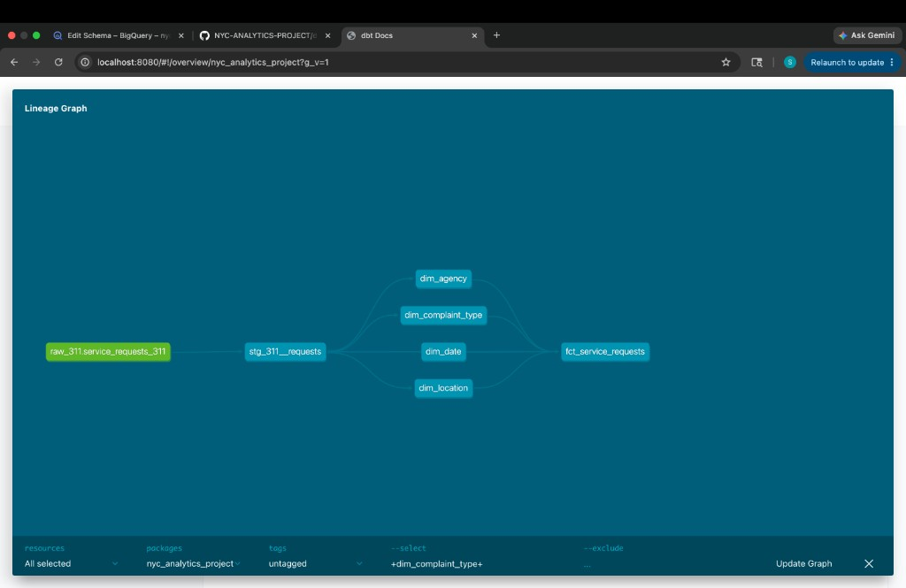

# NYC 311 Analytics Platform

An end-to-end analytics engineering platform that ingests NYC 311 service request data into BigQuery, transforms it into a dimensional model using dbt, orchestrates the pipeline with Dagster, and tracks status history with a Type 2 slowly changing dimension.

**[Live Dashboard →](https://datastudio.google.com/reporting/094bafae-f826-4fdf-915b-aeb815182555/page/qOC0F)**

---

## Lineage Graph



---

## Architecture

```
NYC Socrata API
      │
      ▼
ingestion/socrata_client.py   ← paginated API fetch with retries
      │
      ▼
ingestion/load_to_bigquery.py ← loads raw records into BigQuery
      │
      ▼
BigQuery: raw.service_requests_311
      │
      ▼
dbt: staging layer (stg_311__requests)
      │
      ▼
dbt: marts layer
  ├── dim_agency
  ├── dim_complaint_type
  ├── dim_location
  ├── dim_date
  └── fct_service_requests
      │
      ▼
dbt snapshot: dim_status_scd2 (SCD Type 2)
      │
      ▼
Dagster: daily orchestration of ingestion + dbt build + snapshot
```

---

## Tech Stack

| Layer | Tool |
|---|---|
| Language | Python 3.11+ |
| Warehouse | Google BigQuery |
| Transformation | dbt-core + dbt-bigquery |
| Orchestration | Dagster |
| Version Control | Git + GitHub |
| Package Management | pip + requirements.txt |

---

## Data Source

**NYC 311 Service Requests** via the [Socrata Open Data API](https://dev.socrata.com/foundry/data.cityofnewyork.us/erm2-nwe9)

- Endpoint: `https://data.cityofnewyork.us/resource/erm2-nwe9.json`
- Incremental pulls filtered by `created_date`
- Paginated with `$limit` / `$offset`
- Exponential backoff retry on failed requests

---

## Repository Structure

```
nyc-analytics-platform/
  ingestion/
    __init__.py
    config.py              # reads env vars (GCP project, Socrata token, credentials)
    socrata_client.py      # paginated API generator with retries
    load_to_bigquery.py    # loads pages into BigQuery raw table
  dagster_project/
    __init__.py
    assets.py              # ingestion asset + dbt assets
    definitions.py         # Dagster Definitions: assets, jobs, daily schedule
  dbt_project/
    dbt_project.yml
    packages.yml           # dbt_utils
    models/
      staging/
        _staging__sources.yml
        stg_311__requests.sql
      marts/
        _marts__models.yml
        fct_service_requests.sql
        dim_date.sql
        dim_agency.sql
        dim_complaint_type.sql
        dim_location.sql
    snapshots/
      dim_status_scd2.sql
  requirements.txt
  .env.example
  .gitignore
  README.md
```

---

## Dimensional Model

**Grain of the fact table:** one row per 311 service request.

### `fct_service_requests`

| Column | Type | Description |
|---|---|---|
| `service_request_key` | STRING | Surrogate primary key (hash of unique_key) |
| `unique_key` | STRING | Natural key from NYC 311 source |
| `date_key` | INTEGER | FK → dim_date |
| `agency_key` | STRING | FK → dim_agency |
| `complaint_type_key` | STRING | FK → dim_complaint_type |
| `location_key` | STRING | FK → dim_location |
| `resolution_time_hours` | INTEGER | Hours from creation to closure (null if open) |
| `is_resolved` | BOOLEAN | True if request has been closed |
| `request_count` | INTEGER | Always 1 — for easy SUM aggregation |

### `dim_agency`

| Column | Description |
|---|---|
| `agency_key` | Surrogate key (hash of agency) |
| `agency` | Abbreviated agency code (e.g. NYPD, HPD) |
| `agency_name` | Full agency name |

### `dim_complaint_type`

| Column | Description |
|---|---|
| `complaint_type_key` | Surrogate key (hash of complaint_type + descriptor) |
| `complaint_type` | High-level complaint category |
| `descriptor` | More specific detail within the category |

### `dim_location`

| Column | Description |
|---|---|
| `location_key` | Surrogate key (hash of borough + zip + address) |
| `borough` | NYC borough |
| `incident_zip` | ZIP code |
| `incident_address` | Street address |
| `city` | City |
| `latitude` | Latitude (float) |
| `longitude` | Longitude (float) |

### `dim_date`

| Column | Description |
|---|---|
| `date_key` | Integer key in YYYYMMDD format |
| `full_date` | Calendar date |
| `year` | Year |
| `quarter` | Quarter (1–4) |
| `month` | Month number (1–12) |
| `month_name` | Full month name |
| `day_of_week` | Full day name |
| `is_weekend` | True if Saturday or Sunday |

### `dim_status_scd2` (Snapshot)

Tracks how the `status` field changes over time for each request. Built using a dbt snapshot with `strategy='check'` on the `status` column.

| Column | Description |
|---|---|
| `unique_key` | The 311 request identifier |
| `status` | Request status at this point in time |
| `created_at` | When the request was created |
| `dbt_valid_from` | When this status became active |
| `dbt_valid_to` | When this status ended (null = currently active) |
| `dbt_scd_id` | Surrogate key for this history record |

---

## dbt Tests

All mart models are tested with:
- `unique` and `not_null` on every primary key
- `not_null` on every foreign key in `fct_service_requests`
- `relationships` tests ensuring every foreign key in the fact table has a matching row in its dimension table

---

## Setup & Running Locally

### Prerequisites

- Python 3.11+
- A Google Cloud project with BigQuery API enabled
- A service account with `BigQuery Data Editor` and `BigQuery Job User` roles
- A Socrata app token (free — register at [data.cityofnewyork.us](https://data.cityofnewyork.us))

### 1. Clone the repo

```bash
git clone https://github.com/spennyfinn/NYC-ANALYTICS-PROJECT.git
cd NYC-ANALYTICS-PROJECT
```

### 2. Create and activate a virtual environment

```bash
python3 -m venv .venv
source .venv/bin/activate
```

### 3. Install dependencies

```bash
pip install -r requirements.txt
```

### 4. Configure environment variables

Copy `.env.example` to `.env` and fill in your values:

```bash
cp .env.example .env
```

```
GOOGLE_APPLICATION_CREDENTIALS=/absolute/path/to/your-service-account-key.json
GCP_PROJECT_ID=your-gcp-project-id
SOCRATA_APP_TOKEN=your-socrata-app-token
```

### 5. Configure dbt

Create `~/.dbt/profiles.yml`:

```yaml
nyc_analytics_project:
  target: dev
  outputs:
    dev:
      type: bigquery
      method: service-account
      project: your-gcp-project-id
      dataset: analytics
      keyfile: /absolute/path/to/your-service-account-key.json
      location: US
      threads: 4
```

### 6. Create BigQuery datasets

In the BigQuery console (or via `bq` CLI), create two datasets in your project:
- `raw`
- `analytics`

### 7. Run ingestion

```bash
python -m ingestion.load_to_bigquery --since 2026-01-01
```

This pulls all 311 requests from the given date and loads them into `raw.service_requests_311`.

### 8. Run dbt

```bash
cd dbt_project
dbt deps          # install dbt_utils package
dbt build         # run all models and tests
dbt snapshot      # run the SCD2 status snapshot
dbt docs generate # generate documentation site
dbt docs serve    # open docs at http://localhost:8080
```

### 9. Launch Dagster

```bash
cd ..
dagster dev -f dagster_project/definitions.py
```

Opens the Dagster UI at `http://localhost:3000`. From here you can:
- View the full asset lineage graph
- Manually trigger a pipeline run
- Monitor the daily schedule

---

## Required Environment Variables

| Variable | Description |
|---|---|
| `GOOGLE_APPLICATION_CREDENTIALS` | Absolute path to your GCP service account JSON key |
| `GCP_PROJECT_ID` | Your Google Cloud project ID |
| `SOCRATA_APP_TOKEN` | Socrata API app token for higher rate limits |

See `.env.example` for the template.

---

## Key Design Decisions

**All-string raw schema** — every field in `raw.service_requests_311` is stored as STRING. This makes the raw landing table resilient to type inconsistencies in the source data. All type casting happens in the dbt staging layer where it belongs.

**Generator-based ingestion** — `fetch_pages()` is a Python generator that yields one page at a time. This keeps memory usage flat regardless of dataset size — only 1,000 rows are held in memory at any moment.

**Deduplication in staging** — because ingestion appends rows on every run, `stg_311__requests` deduplicates on `unique_key` using `qualify row_number()`, keeping only the most recently loaded version of each request.

**Surrogate keys via dbt_utils** — dimension keys are MD5 hashes of the natural key columns, generated with `dbt_utils.generate_surrogate_key()`. This is consistent, portable, and doesn't require a sequence or auto-increment.

**SCD Type 2 via dbt snapshot** — `dim_status_scd2` uses dbt's native snapshot mechanism with `strategy='check'` on the `status` column. Every time a request's status changes, dbt closes the old record (`dbt_valid_to`) and inserts a new one, preserving full history.
